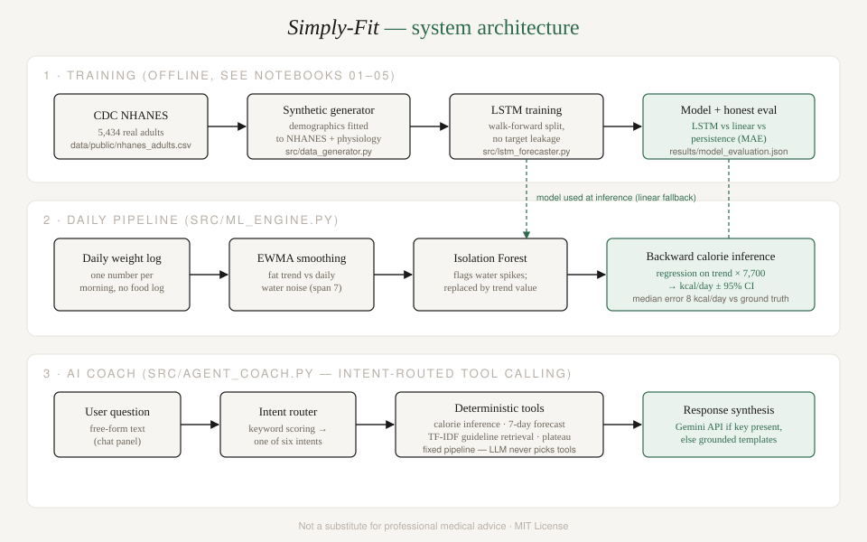

# Simply-Fit

**Live app:** https://simply-fit-apk.streamlit.app/

A personal weight management system built around one idea — **the user never logs food**. Daily weight is already the net result of everything the body consumed and burned; Simply-Fit extracts that signal and infers calorie balance from the trend directly.

> Built as part of a data science internship. All quantitative claims below are reproducible from this repo — every number comes from committed code, committed data, and committed result files.

## Why

Food logging is the standard approach in diet apps, and people abandon it within days. Simply-Fit treats the bathroom scale as a passive sensor instead. The math is the energy-balance equation: a kilogram of fat tissue ≈ 7,700 kcal, so if the smoothed weight trend drops 0.35 kg over seven days, the app infers a deficit of ~385 kcal/day — no food log opened.

## How it works



The user logs one number each morning — their weight. From that:

1. **EWMA smoothing** (span 7) separates real fat change from daily water/glycogen fluctuation.
2. **Isolation Forest** flags anomalous readings (residuals vs the trend) and replaces them with the trend value, so a salty-dinner spike can't corrupt the estimate.
3. **Backward calorie inference**: a linear regression on the cleaned trend gives kg/day; × 7,700 gives the user's actual daily calorie balance, **with a 95% confidence interval**.
4. **7-day forecasting**: an LSTM trained on a synthetic cohort, with linear extrapolation as a transparent fallback.
5. **AI coach**: an intent-routed, tool-calling assistant that answers free-form questions from the user's *own* computed metrics, with clinical guideline retrieval and Gemini API synthesis when a key is available (deterministic templates otherwise — the app works with zero API cost).

## Results (all reproducible)

### Calorie inference accuracy — measured against simulated ground truth

Because training users are simulated with known calorie deltas, the estimator's accuracy can be measured exactly (notebook 02, n = 200 held-out users):

| Comparison | Bias | Median abs. error | 90% of users within |
|---|---|---|---|
| vs **realized** energy balance | **+1 kcal/day** | **8 kcal/day** | ±16 kcal/day |
| vs *target* deficit | +51 kcal/day | 100 kcal/day | ±226 kcal/day |

The gap between "realized" and "target" is not estimator error — it is the simulator's imperfect adherence and metabolic adaptation, which is precisely the signal the app exists to surface.

### Synthetic population vs real CDC NHANES 2017-2018 data

Demographics of the generator were fitted to a committed extract of 5,434 real US adults (`data/public/nhanes_adults.csv`, built directly from CDC `DEMO_J.XPT` + `BMX_J.XPT`); alignment checked with two-sample KS tests (0 = identical distributions):

| Metric | Naive generator (original) | NHANES-calibrated | Improvement |
|---|---|---|---|
| Weight KS | 0.178 | **0.059** | 67% (p = 0.082 — not significantly different) |
| Age KS | 0.361 | **0.085** | 76% |

### 7-day forecast — honest baseline comparison (notebook 03)

| Method | MAE (kg) |
|---|---|
| Linear extrapolation | **0.401** |
| Persistence | 0.468 |
| LSTM | 0.537 |

**An honest negative result:** on this synthetic data the linear extrapolation *beats* the LSTM. The simulator produces near-linear trajectories, so a linear model is correctly specified and the LSTM pays for its flexibility. The LSTM is retained as the research path for real-world logs (weekly cycles, plateaus, non-linear adaptation); the app transparently falls back to linear extrapolation whenever TensorFlow or the model file is absent. Full per-horizon results: `results/model_evaluation.json`.

## Quickstart

```bash
git clone https://github.com/tyagiji369/Simply-Fit.git
cd Simply-Fit
python -m venv venv && source venv/bin/activate
pip install -r requirements.txt
streamlit run app/streamlit_app.py
```

Core install runs the full app (LSTM falls back to linear forecasting; the coach uses deterministic responses). For model training, notebook execution and tests:

```bash
pip install -r requirements-full.txt
pytest -q                                  # 22 tests
python -m src.lstm_forecaster              # retrain + re-evaluate the forecaster
```

Optional: put a free Gemini API key (https://aistudio.google.com) in `.env` (see `.env.example`) or paste it in the app sidebar to enable LLM coach responses.

## Repository layout

```
app/streamlit_app.py        # the 7-step wizard UI + analytics + coach chat
src/ml_engine.py            # EWMA, Isolation Forest, backward calorie inference
src/lstm_forecaster.py      # LSTM training (leakage-free walk-forward) + baselines
src/data_generator.py       # synthetic cohort, demographics fitted to NHANES
src/calibration.py          # KS-test validation against the real NHANES extract
src/agent_coach.py          # intent-routed tool-calling coach (Gemini optional)
src/rag_pipeline.py         # TF-IDF retrieval over clinical guidelines
notebooks/01-05             # data gen → inference → forecasting → coach → validation
data/public/nhanes_adults.csv  # real CDC NHANES 2017-2018 extract (committed)
data/synthetic/             # reproducible synthetic cohort (seed 42)
models/simply_fit_lstm.keras
results/model_evaluation.json
tests/                      # pytest suite
```

## Known limitations

- The LSTM is trained on synthetic data and does not beat a linear baseline there (see above); real-world weight logs are the honest next validation step.
- The 7,700 kcal/kg constant is an approximation (Wishnofsky rule); the reported 95% CI is anti-conservative because EWMA pre-smoothing autocorrelates regression residuals.
- Demographic realism is validated on marginals (age, weight) against unweighted NHANES; the *dynamics* (adherence, adaptation, noise) rest on literature assumptions.
- The coach's clinical guidelines are a small curated set for grounding, not a medical database.

**Not a substitute for professional medical advice.**

## License

MIT — see [LICENSE](LICENSE).
